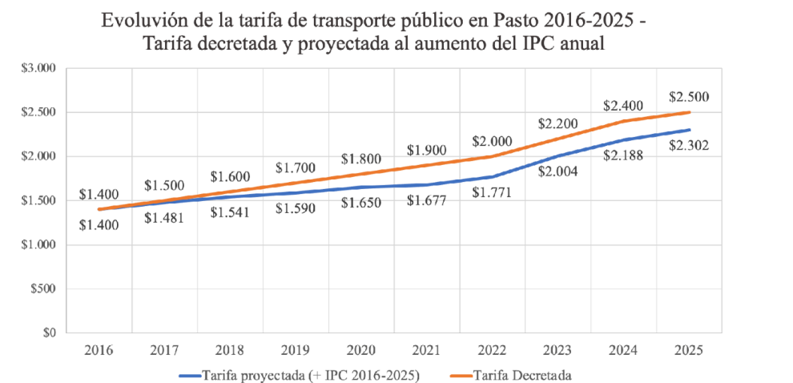
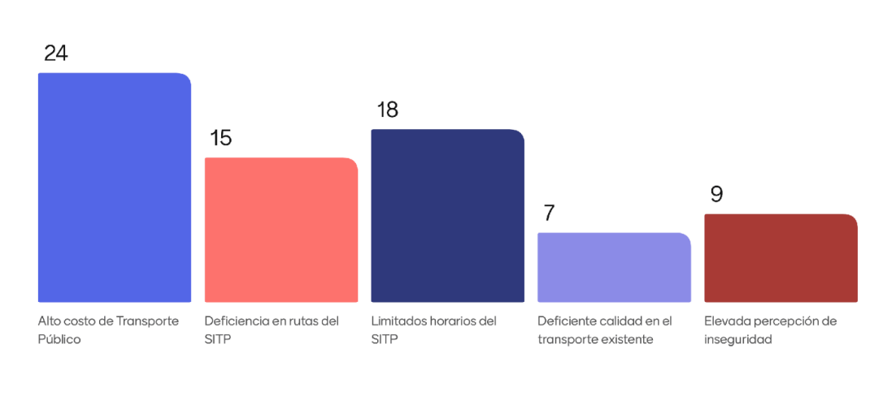

## Anexos

### Análisis comparativo entre ciudades

El objetivo es hacer un análisis comparativo coherente con la ciudad de Pasto. Es fundamental elegir otras ciudades que compartan características similares en términos de:

- Tamaño poblacional  
- Condiciones socioeconómicas  
- Nivel de urbanización  
- Ubicación geográfica (por ejemplo, regiones andinas o de frontera)  
- Oferta educativa (en caso de enfocarse en población estudiantil)

Las ciudades seleccionadas para comparación son:

**1. Popayán (Cauca)**  
- Similar en tamaño poblacional (alrededor de 300 mil habitantes)  
- Capital de departamento, con universidades públicas y privadas  
- Condiciones socioeconómicas y culturales comparables  
- Ubicada también en una región andina con geografía compleja  

**2. Tunja (Boyacá)**  
- Similar en población  
- Ciudad universitaria, con fuerte presencia de la UPTC y otras instituciones  
- Capital de departamento, con características andinas  
- Buen referente para temas de educación y desarrollo territorial  

**3. Armenia (Quindío)**  
- Capital departamental, similar en tamaño  
- Región cafetera, pero con desafíos en conectividad y desarrollo como Pasto  
- Tiene un crecimiento urbano y educativo interesante para comparar  

**4. Manizales (Caldas)**  
- Un poco más grande, pero no tan lejana a Pasto como Bogotá o Medellín  
- Ciudad universitaria y andina  
- Puede servir como caso “aspiracional” o benchmark para modelos más consolidados  

**5. Neiva (Huila)**  
- Capital departamental, con población algo superior pero aún manejable  
- Condiciones de desarrollo similares en algunos aspectos  
- Oferta educativa intermedia  

**6. Florencia (Caquetá)**  
- Más pequeña, pero interesante si se quiere comparar con una ciudad en transición entre zonas rurales y urbanas  
- Capital de departamento con limitaciones estructurales similares a Pasto  

### Indicadores propuestos para comparación

1. Tipo de sistema de transporte público (convencional, integrado, SITM, etc.)  
2. Tarifa promedio del pasaje (COP)  
3. Número estimado de rutas  
4. Cobertura urbana (%)  
5. Frecuencia promedio  
6. Nivel de satisfacción ciudadana (si hay encuestas disponibles)  
7. Presencia de subsidios / tarifas diferenciales  
8. Tecnología usada (tarjeta inteligente, app, GPS, etc.)  

### Comparativo de Tarifas de Transporte Público Colectivo (2017–2025)

| Ciudad     | Tarifa 2017 (COP) | Tarifa 2025 (COP)                        | % Aumento 2017–2025 | Observaciones |
|------------|-------------------|------------------------------------------|----------------------|---------------|
| Pasto      | $1.600            | $2.500                                   | 56.25%               | Incremento reciente de $100 en marzo de 2025 |
| Popayán    | $1.800            | $2.862                                   | 59.00%               | Ajuste para reducir brecha entre tarifa técnica y real |
| Tunja      | $1.800            | $2.400 (diurna), $2.500 (nocturna)       | 33.33%               | Aumento de $200 en 2025 según estudios de costos |
| Armenia    | $1.800            | $2.900 (ordinario), $3.000 (festivos)    | 61.11%               | Incremento de $200 en enero de 2025 |
| Manizales  | $1.800            | $2.650 (bus), $2.900 (buseta)            | 47.22%               | Aumento del 8.2% en buses y 7.4% en busetas |
| Neiva      | $1.600            | $2.800 (básico), $2.900 (nocturno)       | 75.00%               | Reajuste en enero de 2025 según decreto municipal |
| Florencia  | $1.800            | $2.700 (estimado)                        | 50.00%               | Datos aproximados; se requiere confirmación oficial |

Una de las diferencias más destacables en el caso de Pasto es la **ausencia de rutas nocturnas**. Aunque en algunas ciudades el pasaje nocturno es más costoso, su disponibilidad permite mayor flexibilidad para estudiantes con actividades académicas o laborales en horarios extendidos.

## Análisis y Conclusiones Complementarias

Después de todo el trabajo realizado, queda bastante claro que el sistema de transporte público en Pasto no solo tiene problemas logísticos y estructurales, sino que también representa una barrera económica real para muchos estudiantes. Es decir, no se trata solo de que los buses lleguen tarde o que no haya buena cobertura de rutas, sino de que, en términos muy concretos, hay personas que están gastando más en transporte que en la matrícula misma. Y eso, en una ciudad universitaria como Pasto, es algo que debería preocuparnos más de lo que parece preocupar a las autoridades.

Lo que más resalta al comparar con otras ciudades es que Pasto está quedándose atrás en muchas cosas clave: mientras lugares como Tunja o Neiva ya tienen rutas nocturnas, algún tipo de automatización o subsidios diferenciados, en Pasto seguimos con un sistema bastante manual, poco flexible y sin tecnología real para mejorar la experiencia del usuario.

Ahora bien, las soluciones que planteamos aquí no pretenden resolver todo el problema de raíz, porque eso requeriría una reforma completa del sistema y decisiones políticas de alto nivel. Pero sí creemos que pueden marcar una diferencia. Son propuestas pensadas desde la ingeniería electrónica, con recursos accesibles, y lo mejor es que muchas de ellas se pueden desarrollar con lo que ya tenemos. Desde una app que muestre los buses en tiempo real, hasta sensores que midan la contaminación, o una forma más segura de pagar el pasaje… todo eso está al alcance. Y lo más interesante es que se puede empezar por partes, no hay que hacerlo todo de una sola vez.

Obviamente, hay retos: conseguir apoyo institucional, acceso a buses reales para pruebas, o incluso algo tan básico como tener señal de internet estable en toda la ciudad. Pero esos obstáculos no quitan que las ideas sean útiles. De hecho, los retos nos obligan a pensar soluciones más inteligentes, más contextuales, más aterrizadas a nuestra realidad local.

También creemos que este tipo de proyectos abren una posibilidad importante para aplicar tecnología con sentido social. Es decir, no hacer apps por hacer apps, sino usar lo que sabemos para mejorar algo que nos afecta a todos en la vida cotidiana. A veces la ingeniería se siente alejada de los problemas reales, y esto fue una forma de volver a conectar con ellos.

En resumen: el sistema de transporte en Pasto tiene muchas cosas por mejorar, y aunque este documento no es una solución definitiva, sí es un punto de partida. Sirve como base para seguir investigando, desarrollando prototipos, buscando alianzas o incluso presionando un poco más desde la universidad para que se tomen decisiones, sin llegar al punto de protestas agresivas donde los mismos medios de transporte (buses) se vean afectados.

## Visualizaciones del diagnóstico

A continuación se presentan algunas imágenes extraídas del material base entregado por el profesor, que resumen el estado actual del transporte público en Pasto desde diferentes perspectivas:

### 1. Cómo nos movemos en Pasto

---

### 2. Evaluación del servicio

---

### 3. Evolución del sistema

---

### 4. Gasto promedio en transporte

---

### 5. Distribución por tipo de medio de transporte

---

### 6. Problemas específicos identificados

---

### 7. Problemas generales identificados

---

### 8. Proyecciones de impacto o crecimiento

### Fuentes y referencias consultadas

**Neiva**  
- La Nación (2025). “Ojo: Alcaldía de Neiva aumentó 400% el precio del pasaje en colectivo”.  
  [https://www.lanacion.com.co/ojo-alcaldia-de-neiva-aumento-400-el-precio-del-pasaje-en-colectivo](https://www.lanacion.com.co/ojo-alcaldia-de-neiva-aumento-400-el-precio-del-pasaje-en-colectivo)

**Manizales**  
- Caracol Radio (2025). “Conozca las nuevas tarifas para el transporte público en Manizales para el 2025”.  
  [https://caracol.com.co/2025/01/02/conozca-las-nuevas-tarifas-para-el-transporte-publico-en-manizales-para-el-2025](https://caracol.com.co/2025/01/02/conozca-las-nuevas-tarifas-para-el-transporte-publico-en-manizales-para-el-2025)

- Frontera Informativa (2025). “Conozca las nuevas tarifas de transporte público para Manizales”.  
  [https://fronterainformativa.wordpress.com/2025/01/03/conozca-las-nuevas-tarifas-de-transporte-publico-para-manizales](https://fronterainformativa.wordpress.com/2025/01/03/conozca-las-nuevas-tarifas-de-transporte-publico-para-manizales)

- Alcaldía de Manizales (2025). “Actualización en las tarifas del transporte público mixto en Manizales”.  
  [https://centrodeinformacion.manizales.gov.co/actualizacion-en-las-tarifas-del-transporte-publico-mixto-en-manizales](https://centrodeinformacion.manizales.gov.co/actualizacion-en-las-tarifas-del-transporte-publico-mixto-en-manizales)

**Pasto**  
- Página10 (2025). Decreto 0048 del 24 de marzo del 2025 sobre incremento en tarifas.  
  [https://pagina10.com/web/a-traves-del-decreto-0048-del-24-de-marzo-del-2025-la-alcaldia-de-pasto-fijo-el-incremento-de-la-tarifa-del-transporte-publico-en-el-municipio](https://pagina10.com/web/a-traves-del-decreto-0048-del-24-de-marzo-del-2025-la-alcaldia-de-pasto-fijo-el-incremento-de-la-tarifa-del-transporte-publico-en-el-municipio)

- Caracol Radio (2025). “Tarifa diferencial para el transporte colectivo en Pasto: así van los diálogos”.  
  [https://caracol.com.co/2025/04/01/tarifa-diferencial-para-el-transporte-colectivo-en-pasto-asi-van-los-dialogos](https://caracol.com.co/2025/04/01/tarifa-diferencial-para-el-transporte-colectivo-en-pasto-asi-van-los-dialogos)

- La Voz del Pueblo Noticias Nariño (2025).  
  [https://www.facebook.com/LaVozDelPuebloNoticiasNarino/posts/pasto-desde-hoy-26-de-marzo-del-2025-subi%C3%B3-100-pesos-m%C3%A1s-el-valor-del-pasaje-del/648347247946938](https://www.facebook.com/LaVozDelPuebloNoticiasNarino/posts/pasto-desde-hoy-26-de-marzo-del-2025-subi%C3%B3-100-pesos-m%C3%A1s-el-valor-del-pasaje-del/648347247946938)

**Armenia (Quindío)**  
- Alcaldía de Armenia (2024). “Nueva tarifa del transporte público en Armenia empieza a regir a partir del 2 de enero de 2025”.  
  [https://www.armenia.gov.co/atencion-al-ciudadano/noticias/nueva-tarifa-del-transporte-publico-en-armenia-empieza-a-regir-a-partir-del-2-de-enero-de-2025](https://www.armenia.gov.co/atencion-al-ciudadano/noticias/nueva-tarifa-del-transporte-publico-en-armenia-empieza-a-regir-a-partir-del-2-de-enero-de-2025)

**Florencia (Caquetá)**  
- Radio Nacional de Colombia (2024). “Incremento al transporte público en Florencia, Caquetá”.  
  [https://www.radionacional.co/noticias-colombia/tarifa-transporte-publico-florencia-caqueta-2024](https://www.radionacional.co/noticias-colombia/tarifa-transporte-publico-florencia-caqueta-2024)
